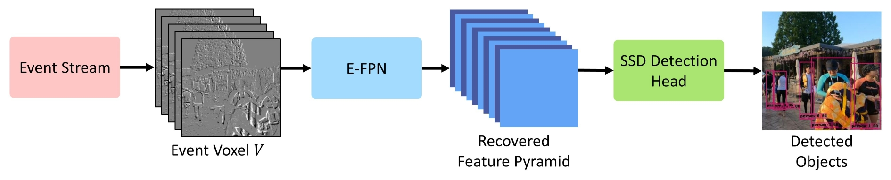
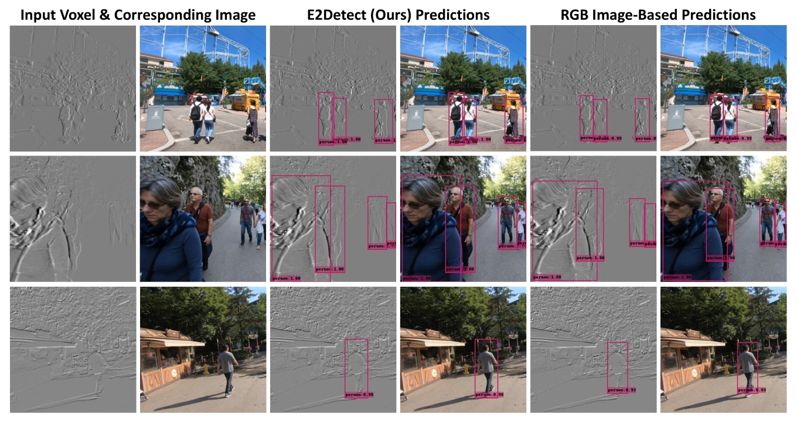

# E2Detect: Object Detection from Event Camera via Sparse Feature Pyramid Recovery
This is the official PyTorch implementation of the IEEE ISCAS 2026 paper titled "[E2Detect: Object Detection from Event Camera via Sparse Feature Pyramid Recovery]()".

E2Detect is a framework for object detection from event cameras by recovering dense feature pyramids from sparse event representations. The recovered features are directly compatible with pretrained detectors like [SSD](https://arxiv.org/abs/1512.02325), enabling plug-and-play inference without retraining detection heads.

**Highlights:**
- Recovers dense feature pyramids directly from sparse event voxels  
- Enables plug-and-play object detection with pretrained SSD  
- Eliminates the need to retrain detection backbones  
- Efficient pipeline for event-based vision tasks  

<br>

<p align="center">
  
  <br>
  Overall pipeline for the proposed E2Detect system.
</p>

<p align="center">
  
  <br>
  Detections by E2Detect (ours) using event voxel and detections via passing RGB image through pretrained <a href="https://arxiv.org/abs/1512.02325">SSD</a>.
</p>

<br>

## Table of Contents
- [Prerequisites](#prerequisites)
- [Installation](#installation)
- [Download Links](#download-links)
- [Quick Start](#quick-start)
- [Dataset Preparation from Scratch](#dataset-preparation-from-scratch)
- [Event Feature Pyramid Network (E-FPN) (Training/Testing)](#event-feature-pyramid-network-e-fpn-trainingtesting)
- [Object Detection from Event Camera](#object-detection-from-event-camera)
- [Citation](#citation)
- [Acknowledgements](#acknowledgements)
- [Contact](#contact)

## Prerequisites
The code was tested on Linux with the following prerequisites:
1. Python 3.13
2. PyTorch 2.7.1 (CUDA 11.8)
3. MATLAB R2021a
4. VLFeat 0.9.21

Remaining libraries are available in [requirements.txt](https://github.com/engrchrishenry/E2Detect/blob/main/requirements.txt)

## Installation

- Clone this repository
   ```bash
   git clone https://github.com/engrchrishenry/E2Detect.git
   cd E2Detect
   ```

- Create conda environment
   ```bash
   conda create --name e2detect python=3.13
   conda activate e2detect
   ```

- Install dependencies
  1. Install [PyTorch](https://pytorch.org/get-started/locally/).
  2. Install [FFmpeg](https://www.ffmpeg.org/download.html).
  3. The remaining packages can be installed via:
     ```bash
     pip install -r requirements.txt
     ```
  4. For running MATLAB scripts, you are required to install [VLFeat](https://www.vlfeat.org/download.html).

## Download Links
- [Precomputed datasets](https://mailmissouri-my.sharepoint.com/:f:/g/personal/chffn_umsystem_edu/IgD5Rw3HYmxPR5NcrudGi-cuAbzlo9fz-r1FWxn0uAbV_L4?e=NMf0RG) (as used in the E2Detect paper)
- [Pre-trained weights](https://mailmissouri-my.sharepoint.com/:u:/g/personal/chffn_umsystem_edu/IQBioWfDDah-RYhP4_UxbAR7Afau96q5_3Vp-qzuSAiu8sA?e=Yza3in)

## Quick Start

- Complete the steps in the [Installation](#installation) section to set up the environment and dependencies.  
- Download and place the [precomputed datasets](https://mailmissouri-my.sharepoint.com/:f:/g/personal/chffn_umsystem_edu/IgD5Rw3HYmxPR5NcrudGi-cuAbzlo9fz-r1FWxn0uAbV_L4?e=NMf0RG) inside the [datasets](https://github.com/engrchrishenry/E2Detect/tree/main/datasets) folder.
  
  ```bash
  unzip datasets/e2detect_processed_data_patches.zip -d datasets
  ```
- Download and place the [pre-trained weights](https://mailmissouri-my.sharepoint.com/:u:/g/personal/chffn_umsystem_edu/IQBioWfDDah-RYhP4_UxbAR7Afau96q5_3Vp-qzuSAiu8sA?e=Yza3in) inside the [weights](https://github.com/engrchrishenry/E2Detect/tree/main/weights) folder.
- Train E-FPN for SSD backbone feature recovery
  ```bash
  python train_E_FPN.py --vox_path datasets/e2detect_processed_data_patches/train/5_0.55_0.005_50_70000_300000/vox \
    --feat_path datasets/e2detect_processed_data_patches/train/5_0.55_0.005_50_70000_300000/ssd_feat_normed \
    --vox_path_valid datasets/e2detect_processed_data_patches/val/5_0.55_0.005_50_70000_300000/vox \
    --feat_path_valid datasets/e2detect_processed_data_patches/val/5_0.55_0.005_50_70000_300000/ssd_feat_normed \
    --out_path logs/ \
    --vox_clip -3.06 3.02 \
    --dct_min datasets/dct_min.npy \
    --dct_max datasets/dct_max.npy \
    --batch_size 32 \
    --epochs 100 \
    --init_lr 0.0001 \
    --gpu_id 0 \
    --n_workers 4
  ```
- Test E-FPN for SSD backbone feature recovery
  ```bash
  python test_E_FPN.py --vox_path datasets/e2detect_processed_data_patches/val/5_0.55_0.005_50_70000_300000/vox \
    --feat_path datasets/e2detect_processed_data_patches/val/5_0.55_0.005_50_70000_300000/ssd_feat_normed \
    --weights weights/e2detect_weights.pth \
    --out_path output/predictions_E_FPN/ \
    --dct_min datasets/dct_min.npy \
    --dct_max datasets/dct_max.npy \
    --vox_clip -3.06 3.02 \
    --batch_size 32 \
    --n_workers 4
  ```
- Detect objects via [SSD](https://arxiv.org/abs/1512.02325) in a plug-n-play manner using the predicted SSD features.

  ```bash
  python get_detections_from_pred_feat.py --config configs/config_SSD.yaml \
    --ckpt weights/vgg_ssd300_voc0712.pth \
    --images_dir datasets/e2detect_processed_data_patches/val/5_0.55_0.005_50_70000_300000/images \
    --feats_dir output/predictions_E_FPN/pred_feat \
    --output_dir output/detections_from_pred_feat/
  ```
- Compute mAP score for *person* class.

  ```bash
  python compute_map_score.py --baseline datasets/e2detect_processed_data_patches/val/5_0.55_0.005_50_70000_300000/detections_from_images.pth \
    --e_fpn output/detections_from_pred_feat/detections_from_feats.pth \
    --selected_ids 15
  ```

## Dataset Preparation from Scratch

> ⚠️ This section is only required if you want to reproduce the dataset from scratch. Most users can skip this section and use the [precomputed datasets](https://mailmissouri-my.sharepoint.com/:f:/g/personal/chffn_umsystem_edu/IgD5Rw3HYmxPR5NcrudGi-cuAbzlo9fz-r1FWxn0uAbV_L4?e=NMf0RG).

### Download [REDS 120fps](https://seungjunnah.github.io/Datasets/reds.html)

- Download [REDS 120fps](https://seungjunnah.github.io/Datasets/reds.html) via the download links provided in [reds_120fps_links.txt]()
    ```bash
    wget -i reds_120fps_links.txt -P REDS_120fps/
    ```

- Unzip files

  ```bash
  unzip REDS_120fps/*.zip -d REDS_120fps/
  ```

- [Optional] Delete the .zip files to save storage space.
  ```bash
  rm REDS_120fps/*.zip
  ```

### Preprocessing [REDS 120fps](https://seungjunnah.github.io/Datasets/reds.html) for [ESIM](https://github.com/uzh-rpg/rpg_vid2e/tree/master)

- Preprocess the [REDS 120fps](https://seungjunnah.github.io/Datasets/reds.html) dataset for generating synthetic events via [ESIM](https://github.com/uzh-rpg/rpg_vid2e/tree/master).
   ```bash
   # Preprocess REDS 120fps dataset (training set) for ESIM
   python preprocess_reds_fast.py --data_dir REDS_120fps/train/train_orig/ \
      --out_dir output/reds_for_esim/train/ \
      --fps 120 \
      --resize \
      --img_size 533:300 \
      --cores -1
   
   # Preprocess REDS 120fps dataset (validation set) for ESIM
   python preprocess_reds_fast.py --data_dir REDS_120fps/val/val_orig/ \
      --out_dir output/reds_for_esim/val/ \
      --fps 120 \
      --resize \
      --img_size 533:300 \
      --cores -1
   ```

### Synthetic Event Generation via [ESIM](https://github.com/uzh-rpg/rpg_vid2e/tree/master)
  
- Follow the instructions [here](https://github.com/uzh-rpg/rpg_vid2e/tree/master) to setup ESIM and build the python binding with GPU support. Use a different conda environment with the exact versions of the dependencies reqired to run ESIM with GPU support. Once ESIM is setup:

  ```bash
  # Generate synthetic events for training
  python esim_torch/scripts/generate_events.py --input_dir=<reds_for_esim_train_path> \
    --output_dir=<events_output_path> \
    --contrast_threshold_neg=0.2 \
    --contrast_threshold_pos=0.2 \
    --refractory_period_ns=0
   
   # Generate synthetic events for valdation
   python esim_torch/scripts/generate_events.py --input_dir=<reds_for_esim_val_path> \
    --output_dir=<events_output_path> \
    --contrast_threshold_neg=0.2 \
    --contrast_threshold_pos=0.2 \
    --refractory_period_ns=0
  ```

### Event Voxel and Patch Generation

  - Generate event voxels
    ```bash
    # Voxel generation for training data
    python prep_data_esim_fast.py --events_dir <synthetic_train_events_path> \
      --upsamp_frames_dir <reds_for_esim_train_path> \
      --out_dir <output_path>

    # Voxel generation for validation data
    python prep_data_esim_fast.py --events_dir <synthetic_validation_events_path> \
      --upsamp_frames_dir <reds_for_esim_validation_path> \
      --out_dir <output_path>
    ```

    Usage:

    ```bash
    options:
      -h, --help            show this help message and exit
      --events_dir EVENTS_DIR
                              Path to directory containing ESIM-generated synthetic events
      --upsamp_frames_dir UPSAMP_FRAMES_DIR
                              Path to directory containing upsampled frames
      --out_dir OUT_DIR     Path to output directory
      --bins BINS           Number of bins for event voxel generation
      --dur_sec DUR_SEC     Event window duration in seconds
      --res RES             Event camera resolution (e.g., '533:300')
      --events_th_low EVENTS_TH_LOW
                              Lower threshold for limiting the number of events within an event window. None to ignore.
      --events_th_high EVENTS_TH_HIGH
                              Upper threshold for limiting the number of events within an event window. None to ignore.
      --kp_th KP_TH         Keypoint threshold for rejecting blank frames. None to ignore.
      --sd_th SD_TH         Standard deviation threshold. None to ignore.
      --range_th RANGE_TH   Range (max value - min value) threshold. None to ignore.
      --th_hist TH_HIST     Clipping threshold for histogram plotting. Value between 0 and 100, e.g., 99.9 means clipping at 99.9 percentile.
      --plot                Save plots.
      --cores CORES         Number of cores to use. -1 -> use all cores.
    ```
  
  - Generate patches for training/validation
    ```bash
    # Generate patches for training
    python gen_patches_fast.py --base_path <train_voxels_path> \
      --out_path <output_train_patches_path> \
      --ip_size 533:300 \
      --patch_size  300:300 \
      --cores -1

    # Generate patches for validation
    python prep_data_esim_fast.py --base_path <validation_voxels_path> \
      --out_path <output_validation_patches_path> \
      --ip_size  533:300 \
      --patch_size  300:300 \
      --cores -1
    ```

### Generate Ground Truth SSD Bottleneck Features
- Download pretrained weights
  ```bash
  # Download pretrained weights for VGG16 backbone
  wget https://s3.amazonaws.com/amdegroot-models/vgg16_reducedfc.pth -P weights/

  # Download pretrained weights for SSD300 trained on PASCAL VOC dataset
  wget https://github.com/lufficc/SSD/releases/download/1.2/vgg_ssd300_voc0712.pth -P weights/
  ```

- Generate ground truth SSD backbone features for training/validating the proposed E-FPN
  ```bash
  # For training data
  python get_gt_feat.py --config configs/SSD_config.yaml \
    --ckpt weights/vgg_ssd300_voc0712.pth \
    --images_dir <train_image_path> \
    --output_dir <train_gt_feat_output_path>
  
  # For validation data
  python get_gt_feat.py --config configs/SSD_config.yaml \
    --ckpt weights/vgg_ssd300_voc0712.pth \
    --images_dir <validation_image_path> \
    --output_dir <validation_gt_feat_output_path>
  ```

> Note: The download links for the weights and the code for SSD were taken/modified from [Luffic's SSD repository](https://github.com/lufficc/SSD?tab=readme-ov-file), which is licensed under the MIT License.

## Event Feature Pyramid Network (E-FPN) (Training/Testing)

- ### Training
  To train using [precomputed datasets](https://mailmissouri-my.sharepoint.com/:u:/g/personal/chffn_umsystem_edu/IQDeRuf3mEdfS57IjLFIBU-hAdwEB-Q94AsmyDim1bYuwms?e=HeZhI8) (placed inside [datasets](https://github.com/engrchrishenry/E2Detect/tree/main/datasets) folder) and using the same parameters as used in E2Detect paper, run the following:

  ```bash
  python train_E_FPN.py --vox_path datasets/e2detect_processed_data_patches/train/5_0.55_0.005_50_70000_300000/vox \
    --feat_path datasets/e2detect_processed_data_patches/train/5_0.55_0.005_50_70000_300000/ssd_feat_normed \
    --vox_path_valid datasets/e2detect_processed_data_patches/val/5_0.55_0.005_50_70000_300000/vox \
    --feat_path_valid datasets/e2detect_processed_data_patches/val/5_0.55_0.005_50_70000_300000/ssd_feat_normed \
    --out_path logs/ \
    --vox_clip -3.06 3.02 \
    --dct_min datasets/dct_min.npy \
    --dct_max datasets/dct_max.npy \
    --batch_size 32 \
    --epochs 100 \
    --init_lr 0.0001 \
    --gpu_id 0 \
    --n_workers 4
  ```

  For usage instructions, run `python train_E_FPN.py --help`.

- ### Testing
  Use the [pre-trained weights](https://mailmissouri-my.sharepoint.com/:u:/g/personal/chffn_umsystem_edu/IQBioWfDDah-RYhP4_UxbAR7Afau96q5_3Vp-qzuSAiu8sA?e=Yza3in) (placed inside [weights](https://github.com/engrchrishenry/E2Detect/tree/main/weights) folder) and the [precomputed datasets](https://mailmissouri-my.sharepoint.com/:f:/g/personal/chffn_umsystem_edu/IgD5Rw3HYmxPR5NcrudGi-cuAbzlo9fz-r1FWxn0uAbV_L4?e=NMf0RG) (placed inside [datasets](https://github.com/engrchrishenry/E2Detect/tree/main/datasets) folder) to reproduce results from the E2Detect paper. Run the following:

  ```bash
  python test_E_FPN.py --vox_path datasets/e2detect_processed_data_patches/val/5_0.55_0.005_50_70000_300000/vox \
    --feat_path datasets/e2detect_processed_data_patches/val/5_0.55_0.005_50_70000_300000/ssd_feat_normed \
    --weights weights/e2detect_weights.pth \
    --out_path output/predictions_E_FPN/ \
    --dct_min datasets/dct_min.npy \
    --dct_max datasets/dct_max.npy \
    --vox_clip -3.06 3.02 \
    --batch_size 32 \
    --n_workers 4
  ```

    For usage instructions, run `python test_E_FPN.py --help`.
  
- **Note:** If you prepared the dataset from scratch, you should recompute `--vox_clip` and `--dct_min`/`--dct_max` values for use during training and testing:

  ```bash
  # Event voxel clipping value (--vox_clip)
  python get_vox_log_clip_thresh.py --data_path <event_voxels_path> \
    --save_file output/hists/vox_hist.png \
    --samp_percent 5 \
    --hist_pctl 99.9

  # DCT normalization values (--dct_min/--dct_max)
  python get_dct_min_max.py --data_dir <event_voxels_path> \
    --vox_clip <vox_min> <vox_max> \
    --num_voxels 4000 \
    --model_ip_size 300:300 \
    --out_path output/dct_norm
  ```

## Object Detection from Event Camera

- Run the following to use the predicted SSD features to detect objects via [SSD](https://arxiv.org/abs/1512.02325) in a plug-n-play manner.

  ```bash
  python get_detections_from_pred_feat.py --config configs/config_SSD.yaml \
    --ckpt weights/vgg_ssd300_voc0712.pth \
    --images_dir datasets/e2detect_processed_data_patches/val/5_0.55_0.005_50_70000_300000/images \
    --feats_dir output/predictions_E_FPN/pred_feat \
    --output_dir output/detections_from_pred_feat/
  ```

- Compute mAP score for *person* class.

  ```bash
  python compute_map_score.py --baseline datasets/e2detect_processed_data_patches/val/5_0.55_0.005_50_70000_300000/detections_from_images.pth \
    --e_fpn output/detections_from_pred_feat/detections_from_feats.pth \
    --selected_ids 15
  ```


## Citation

If you use this code, please cite:

```bibtex
@INPROCEEDINGS{11562756,
  author={Henry, Chris and Li, Zhu and Katsaggelos, Aggelos K.},
  booktitle={2026 IEEE International Symposium on Circuits and Systems (ISCAS)}, 
  title={E2Detect: Object Detection from Event Camera via Sparse Feature Pyramid Recovery}, 
  year={2026},
  volume={},
  number={},
  pages={957-961},
  keywords={Object detection;Printing;Conferences;Cameras;Event detection;Computers;Signal detection;Computer vision;Modeling;Detectors},
  doi={10.1109/ISCAS66217.2026.11562756}}
```

You may also explore our work on event-based SIFT keypoint detection, **E2SIFT** ([Paper](https://ieeexplore.ieee.org/document/10647465/) | [Code](https://github.com/engrchrishenry/E2SIFT)). If you use E2SIFT, please cite:

```bibtex
@INPROCEEDINGS{10647465,
  author={Henry, Chris and Maharjan, Paras and Li, Zhu and York, George},
  booktitle={2024 IEEE International Conference on Image Processing (ICIP)}, 
  title={E2SIFT: Neuromorphic SIFT via Direct Feature Pyramid Recovery from Events}, 
  year={2024},
  volume={},
  number={},
  pages={2786-2792},
  keywords={Thresholding (Imaging);Neuromorphics;Detectors;Transforms;Streaming media;Vision sensors;Cameras;neuromorphic vision sensor;event camera;scale-invariant feature transform;SIFT;keypoint detection},
  doi={10.1109/ICIP51287.2024.10647465}}
```
  
## Acknowledgements

This work was partially supported by the National Science Foundation (NSF) under Award 2148382.

- [TSF-Net](ieeexplore.ieee.org/document/10275101/) model implementation was adapted from: https://github.com/parasmaharjan/TSFNet  
- Some parts of the event data processing were adapted from: https://github.com/uzh-rpg/rpg_e2vid
- The code for [SSD](https://arxiv.org/abs/1512.02325) were taken/modified from [Luffic's SSD repository](https://github.com/lufficc/SSD?tab=readme-ov-file), which is licensed under the MIT License.

We gratefully acknowledge the authors and contributors for making their work publicly available.

## Contact
If you have questions or issues regarding the code, feel free to contact: chffn@umsystem.edu or engr.chrishenry@gmail.com

